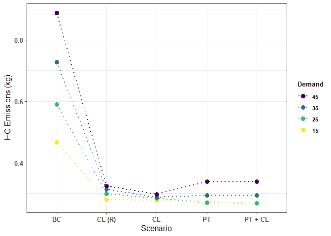

analysis\_DC\_mk.R
================
Dylan Johnson
06/05/2021

## R Markdown

``` r
library(ggplot2)
library(ggpubr)
library(ggthemes)
library(viridis)
library(hrbrthemes)
library(tidyverse)
library(knitr)
opts_chunk$set(dev="png")
```

``` r
colnames(network_macroscopic)[1]<-"Scenario"
network_macroscopic$Scenario <- gsub('.{3}$', '', network_macroscopic$Scenario)
network_macroscopic$Demand <- c(rep(seq(15,45,10)))
network_macroscopic <- network_macroscopic[, c(1,12,2:11)]
network_macroscopic$Demand <- as.factor(network_macroscopic$Demand)
network_macroscopic$Scenario <- as.factor(network_macroscopic$Scenario)
network_macroscopic$Demand <- fct_rev(network_macroscopic$Demand)
network_macroscopic$CO2_kg <- network_macroscopic$emissions_CO2_abs/1000000
network_macroscopic$CO_kg <- network_macroscopic$emissions_CO_abs/1000000
network_macroscopic$HC_kg <- network_macroscopic$emissions_HC_abs/1000000
network_macroscopic$NOx_kg <- network_macroscopic$emissions_NOx_abs/1000000
network_macroscopic$PMx_kg <- network_macroscopic$emissions_PMx_abs/1000000
```

``` r
co2  <- ggplot(network_macroscopic, aes(x = Scenario, y = CO2_kg, colour = Demand, group = Demand)) + 
  geom_line(size=1, linetype=3) + 
  scale_colour_viridis(discrete = TRUE)+
  geom_point(size=3) + 
  theme_bw() +
  xlab("Scenario") +
  ylab(expression('CO'[2]*' Emissions (kg)') ) +
  theme(axis.title.x=element_text(size=12)) +
  theme(axis.text.x=element_text(size=10, face = "bold")) + 
  theme(axis.title.y=element_text(size=12, face = "bold")) +
  theme(axis.text.y=element_text(size=10, face = "bold")) +
  theme(legend.title=element_text(size=10, face= "bold"))+
  theme(legend.text=element_text(size=8, face = "bold")) +
  guides(fill=guide_legend(title= "Delivery \nDemand")) +
  scale_x_discrete(limits = c("CL (R)", "BC", "CL", "PT", "PT + CL"))
co2
```

<!-- -->

## Hydrocarbon

``` r
HC  <- ggplot(network_macroscopic, aes(x = Scenario, y = HC_kg, colour = Demand, group = Demand)) + 
  geom_line(size=1, linetype=3) + 
  scale_colour_viridis(discrete = TRUE)+
  geom_point(size=3) + 
  theme_bw() +
  xlab("Scenario") +
  ylab(expression('HC Emissions (kg)') ) +
  theme(axis.title.x=element_text(size=12)) +
  theme(axis.text.x=element_text(size=10, face = "bold")) + 
  theme(axis.title.y=element_text(size=12, face = "bold")) +
  theme(axis.text.y=element_text(size=10, face = "bold")) +
  theme(legend.title=element_text(size=10, face= "bold"))+
  theme(legend.text=element_text(size=8, face = "bold")) +
  guides(fill=guide_legend(title= "Delivery \nDemand")) +
  scale_x_discrete(limits = c( "BC", "CL (R)", "CL", "PT", "PT + CL"))
HC
```

<!-- -->

## Nitrogen Oxide

``` r
NOx  <- ggplot(network_macroscopic, aes(x = Scenario, y = NOx_kg, colour = Demand, group = Demand)) + 
  geom_line(size=1, linetype=3) + 
  scale_colour_viridis(discrete = TRUE)+
  geom_point(size=3) + 
  theme_bw() +
  xlab("Scenario") +
  ylab(expression('NOx Emissions (kg)') ) +
  theme(axis.title.x=element_text(size=12)) +
  theme(axis.text.x=element_text(size=10, face = "bold")) + 
  theme(axis.title.y=element_text(size=12, face = "bold")) +
  theme(axis.text.y=element_text(size=10, face = "bold")) +
  theme(legend.title=element_text(size=10, face= "bold"))+
  theme(legend.text=element_text(size=8, face = "bold")) +
  guides(fill=guide_legend(title= "Delivery \nDemand")) +
  scale_x_discrete(limits = c( "BC", "CL (R)", "CL", "PT", "PT + CL"))
NOx
```

<!-- -->

\#\#Particulate Matter

``` r
PMx  <- ggplot(network_macroscopic, aes(x = Scenario, y = PMx_kg, colour = Demand, group = Demand)) + 
  geom_line(size=1, linetype=3) + 
  scale_colour_viridis(discrete = TRUE)+
  geom_point(size=3) + 
  theme_bw() +
  xlab("Scenario") +
  ylab(expression('PMx Emissions (kg)') ) +
  theme(axis.title.x=element_text(size=12)) +
  theme(axis.text.x=element_text(size=10, face = "bold")) + 
  theme(axis.title.y=element_text(size=12, face = "bold")) +
  theme(axis.text.y=element_text(size=10, face = "bold")) +
  theme(legend.title=element_text(size=10, face= "bold"))+
  theme(legend.text=element_text(size=8, face = "bold")) +
  guides(fill=guide_legend(title= "Delivery \nDemand")) +
  scale_x_discrete(limits = c( "BC", "CL (R)", "CL", "PT", "PT + CL"))
PMx
```

<!-- -->

# Network Effects

##### Duration

``` r
network_macroscopic$duration_hr <- network_macroscopic$tripinfo_duration/3600
network_macroscopic$timeLoss_hr <- network_macroscopic$tripinfo_timeLoss/3600
network_macroscopic$waitingTime_hr <- network_macroscopic$tripinfo_waitingTime/3600
```

``` r
Duration  <- ggplot(network_macroscopic, aes(x = Scenario, y = duration_hr, colour = Demand, group = Demand)) + 
  geom_line(size=1, linetype=3) + 
  scale_colour_viridis(discrete = TRUE)+
  geom_point(size=3) + 
  theme_bw() +
  xlab("Scenario") +
  ylab(expression('Total Network Trip Time (hr)') ) +
  theme(axis.title.x=element_text(size=12)) +
  theme(axis.text.x=element_text(size=10, face = "bold")) + 
  theme(axis.title.y=element_text(size=12, face = "bold")) +
  theme(axis.text.y=element_text(size=10, face = "bold")) +
  theme(legend.title=element_text(size=10, face= "bold"))+
  theme(legend.text=element_text(size=8, face = "bold")) +
  guides(fill=guide_legend(title= "Delivery \nDemand")) + 
  scale_x_discrete(limits = c( "BC", "CL (R)", "CL", "PT", "PT + CL"))
Duration
```

<!-- -->

# Time Loss

``` r
Time_loss  <- ggplot(network_macroscopic, aes(x = Scenario, y = timeLoss_hr, colour = Demand, group = Demand)) + 
  geom_line(size=1, linetype=3) + 
  scale_colour_viridis(discrete = TRUE)+
  geom_point(size=3) + 
  theme_bw() +
  xlab("Scenario") +
  ylab(expression('Total Network Time Loss (hr)') ) +
  theme(axis.title.x=element_text(size=12)) +
  theme(axis.text.x=element_text(size=10, face = "bold")) + 
  theme(axis.title.y=element_text(size=12, face = "bold")) +
  theme(axis.text.y=element_text(size=10, face = "bold")) +
  theme(legend.title=element_text(size=10, face= "bold"))+
  theme(legend.text=element_text(size=8, face = "bold")) +
  guides(fill=guide_legend(title= "Delivery \nDemand")) + 
  scale_x_discrete(limits = c( "BC", "CL (R)", "CL", "PT", "PT + CL"))

Time_loss
```

<!-- -->

# Waiting\_Time

``` r
Waiting_time  <- ggplot(network_macroscopic, aes(x = Scenario, y = waitingTime_hr, colour = Demand, group = Demand)) + 
  geom_line(size=1, linetype=3) + 
  scale_colour_viridis(discrete = TRUE)+
  geom_point(size=3) + 
  theme_bw() +
  xlab("Scenario") +
  ylab(expression('Total Network Wait Time (hr)') ) +
  theme(axis.title.x=element_text(size=12)) +
  theme(axis.text.x=element_text(size=10, face = "bold")) + 
  theme(axis.title.y=element_text(size=12, face = "bold")) +
  theme(axis.text.y=element_text(size=10, face = "bold")) +
  theme(legend.title=element_text(size=10, face= "bold"))+
  theme(legend.text=element_text(size=8, face = "bold")) +
  guides(fill=guide_legend(title= "Delivery \nDemand")) +
  scale_x_discrete(limits = c( "BC", "CL (R)", "CL", "PT", "PT + CL"))
Waiting_time
```

<!-- -->
