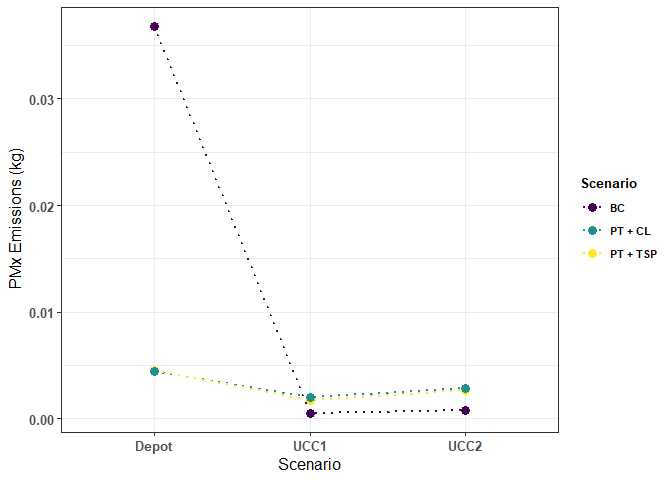
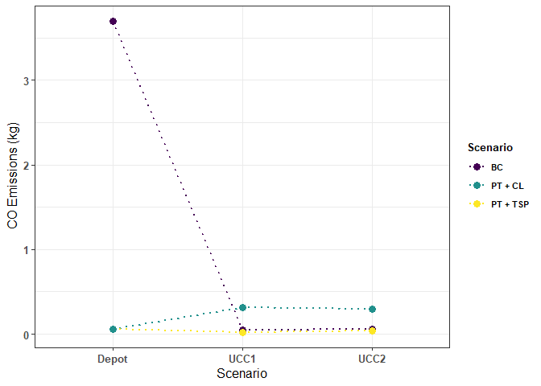
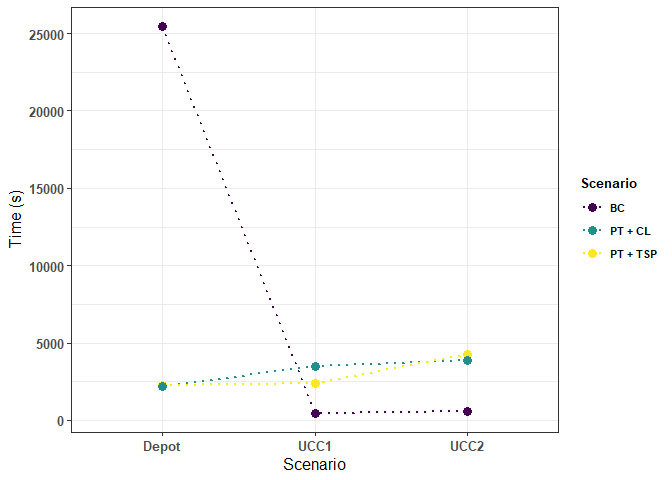

UCC\_edge
================
Dylan Johnson
11/06/2021

``` r
library(ggplot2)
library(ggpubr)
library(ggthemes)
library(viridis)
library(hrbrthemes)
library(tidyverse)
library(knitr)
library(tidyverse)
library(dplyr)

opts_chunk$set(dev="png")
```

#### Simulations in Sumo

``` r
n <- 0
for (i in scenario){
  for (j in config_files){
    n <- n+1
    datasets[n] <- paste(i,j, sep = plsep)
    for (k in datasets){
      com[k] <- paste("sumo -c ", '"', paste(k),'"'," --device.emissions.probability 1.0",sep = "")
    }  
  }
}

for (z in com){
  system(paste(z))
}
```

#### Convert Files from XML to CSV

``` r
datasets <- c()
com <- c()
n <- 0
for (i in scenario){
  for (j in xml_files){
    n <- n+1
    datasets[n] <- paste(i,j, sep = plsep)
  }
}

n <- 0
demandset <- c()
for (x in scenario){
  for (y in demand_files){
    n <- n+1
    demandset[n] <- paste(x,y, sep = plsep)
  }
}

datasets_new <- paste('"',paste(datasets), '"', sep = "")
demandset_new <-  paste('"',paste(demandset), '"', sep = "")
combined = paste(datasets_new, demandset_new, sep = " -o ")

com <- c()
for (i in combined){
  com[i] <- paste('python ','"',xml_csv,'" ', paste(i), sep = "")
} 

for (z in com){
  system(paste(z))
}
```

#### Create Matrix for relevant edges surrounding microdepots

``` r
n <- 0
z <- 0
datasets <- list()

for (i in scenario) {
  n <- n+1
  z <- z+1
  datasets[[n]] <- read.csv(paste(i,demand_files[z],sep = plsep), sep = ";")
}

bc <- datasets[[1]]
bc = bc[which(bc$edge_id == "806271971"|bc$edge_id == "421790823"| bc$edge_id == "-6057932#0"),]
#View(bc)

tsp <- datasets[[2]]
tsp = tsp[which(tsp$edge_id == "806271971"|tsp$edge_id == "421790823"| tsp$edge_id == "-6057932#0"),]
#tsp

vrp <- datasets[[3]]
vrp = vrp[which(vrp$edge_id == "806271971"|vrp$edge_id == "421790823"| vrp$edge_id == "-6057932#0"),]
#vrp

## Make column for Scenario and UCC 
#bc
scenario <- c("BC", "BC", "BC")
bc$Scenario <- scenario
UCCs <- c("UCC2", "UCC1", "Depot")
bc$UCC <- UCCs
#tsp
scenario <- c("PT + TSP", "PT + TSP", "PT + TSP")
tsp$Scenario <- scenario
tsp$UCC <- UCCs
#vrp
scenario <- c("PT + CL", "PT + CL", "PT + CL")
vrp$Scenario <- scenario
vrp$UCC <- UCCs

micro_depots <- rbind(bc, tsp, vrp)

keep <- c("edge_CO2_abs", "edge_CO_abs", "edge_HC_abs", "edge_NOx_abs", "edge_PMx_abs", "edge_sampledSeconds", "Scenario", "UCC")
micro_depots <- micro_depots[, (names(micro_depots) %in% keep)]
micro_depots$CO2_kg <- micro_depots$edge_CO2_abs/1000000
micro_depots$CO_kg <- micro_depots$edge_CO_abs/1000000
micro_depots$HC_kg <- micro_depots$edge_HC_abs/1000000
micro_depots$NOx_kg <- micro_depots$edge_NOx_abs/1000000
micro_depots$PMx_kg <- micro_depots$edge_PMx_abs/1000000
micro_depots <- micro_depots[,c(7,8, 1:6, 9:13)]
```

#### Plots

``` r
PMx  <- ggplot(micro_depots, aes(x = UCC, y = PMx_kg, colour = Scenario, group = Scenario)) + 
  geom_line(size=1, linetype=3) + 
  scale_colour_viridis(discrete = TRUE)+
  geom_point(size=3) + 
  theme_bw() +
  xlab("Scenario") +
  ylab(expression('PMx Emissions (kg)') ) +
  theme(axis.title.x=element_text(size=12)) +
  theme(axis.text.x=element_text(size=10, face = "bold")) + 
  theme(axis.title.y=element_text(size=12, face = "bold")) +
  theme(axis.text.y=element_text(size=10, face = "bold")) +
  theme(legend.title=element_text(size=10, face= "bold"))+
  theme(legend.text=element_text(size=8, face = "bold")) +
  guides(fill=guide_legend(title= "Scenario")) +
  scale_x_discrete(limits = c( "Depot", "UCC1", "UCC2"))
PMx
```

<!-- -->

``` r
CO <- ggplot(micro_depots, aes(x = UCC, y = CO_kg, colour = Scenario, group = Scenario)) + 
  geom_line(size=1, linetype=3) + 
  scale_colour_viridis(discrete = TRUE)+
  geom_point(size=3) + 
  theme_bw() +
  xlab("Scenario") +
  ylab(expression('CO Emissions (kg)') ) +
  theme(axis.title.x=element_text(size=12)) +
  theme(axis.text.x=element_text(size=10, face = "bold")) + 
  theme(axis.title.y=element_text(size=12, face = "bold")) +
  theme(axis.text.y=element_text(size=10, face = "bold")) +
  theme(legend.title=element_text(size=10, face= "bold"))+
  theme(legend.text=element_text(size=8, face = "bold")) +
  guides(fill=guide_legend(title= "Scenario")) +
  scale_x_discrete(limits = c( "Depot", "UCC1", "UCC2"))
CO
```

<!-- -->

``` r
time <- ggplot(micro_depots, aes(x = UCC, y = edge_sampledSeconds, colour = Scenario, group = Scenario)) + 
  geom_line(size=1, linetype=3) + 
  scale_colour_viridis(discrete = TRUE)+
  geom_point(size=3) + 
  theme_bw() +
  xlab("Scenario") +
  ylab(expression('Time (s)') ) +
  theme(axis.title.x=element_text(size=12)) +
  theme(axis.text.x=element_text(size=10, face = "bold")) + 
  theme(axis.title.y=element_text(size=12, face = "bold")) +
  theme(axis.text.y=element_text(size=10, face = "bold")) +
  theme(legend.title=element_text(size=10, face= "bold"))+
  theme(legend.text=element_text(size=8, face = "bold")) +
  guides(fill=guide_legend(title= "Scenario")) +
  scale_x_discrete(limits = c( "Depot", "UCC1", "UCC2"))
time
```

<!-- -->
